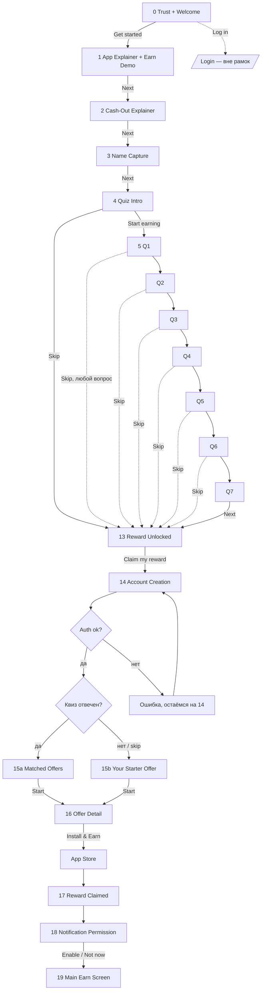
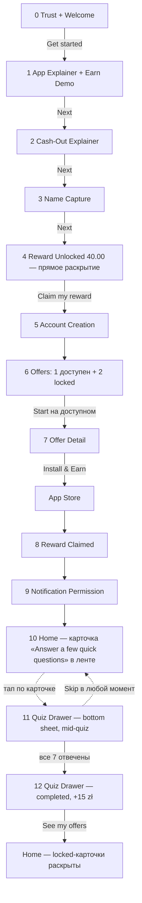
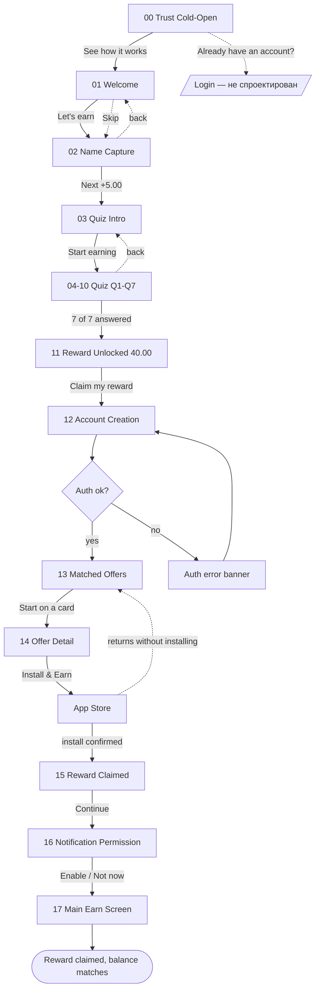

# Онбординг-флоу — структура и LoFi

> **Три версии одновременно.** v2 — superseded (историческая, раздел внизу файла).
> **v3 и v4 — оба живые варианты**, не один поверх другого: v3 держит квиз внутри
> онбординга (пропускаемый), v4 выносит квиз из онбординга целиком, возвращая его
> как bottom-drawer после логина. Экраны — в Figma, страницы **«Onboarding — LoFi v3»**
> и **«Onboarding — LoFi v4 (quiz-as-drawer)»**.

Компоненты и токены — [design-system.md](design-system.md). Аудит компонентов —
[audit.md](audit.md). Мудборд/дискавери — [research.md](research.md).

---

# v3 — квиз внутри онбординга, пропускаемый

## Зачем v3

Голосовое сообщение Said, дословно: старый онбординг с длинным опросником **не решал
проблему, которую должен был решать** — время до первой награды оставалось длинным,
а сам процесс был недостаточно эмоциональным. v3 отвечает на это тремя структурными
изменениями:

1. **Trust + Welcome слиты в один экран** (было три) — минус шаг перед любой пользой.
2. **Добавлен emotional/gamified экран** — сценарная демонстрация match-3 с монетами,
   летящими в баланс, вместо сухого текста «мы платим деньги».
3. **Квиз стал по-настоящему пропускаемым** — видимая ссылка «Skip» на **каждом**
   вопросе, а не только в интро. Раньше пропустить можно было только весь опрос сразу
   в одном месте; теперь — на любом шаге, в любой момент.

## Цель флоу (не изменилась)

**Пользователь:** новый, из стора, о продукте не знает ничего, внимание короткое.
**Одна цель:** первая полученная награда в первой сессии (PRD, primary metric).
**Критерий успеха:** экран 17 (Reward Claimed) показан без необъяснённого шага и без
нарушенного обещания.

## Схема

## Мэппинг: что переиспользовано из v2, что построено заново

Технический приём для скорости и согласованности — часть контента v2 не рисовалась
заново, а дублировалась и правилась.

| v3 экран | Источник | Правка |
|---|---|---|
| 0 Trust + Welcome | v2 `00` без изменений | статы: остался только Trustpilot (см. открытый вопрос) |
| 3 Name Capture | v2 `02` | реальный Earnings Meter стартует здесь с 0.00 |
| 4 Quiz Intro | v2 `03` | + видимая ссылка «Skip» |
| 5–11 Q1–Q7 | v2 `04–10` | + «Skip» на каждом; CTA без суммы (`Next`, не `Next [+X zł]`) |
| 13 Reward Unlocked | v2 `11` без изменений | приходит и с Q7, и со скипа |
| 14 Account Creation | v2 `12` без изменений | — |
| 16–19 | v2 `14–17` без изменений | Offer Detail, Reward Claimed, Notification, Main Earn |
| **1 App Explainer + Earn Demo** | — | **новый**, самый важный экран v3 |
| **2 Cash-Out Explainer** | контент был частью старого «Welcome» | **новый экран**, одна идея — один экран |
| **15a Matched Offers** | v2 `13`, контент не менялся | переименован под форк |
| **15b Your Starter Offer** | — | **новый**, честный fallback без ложной персонализации |

## Модель баланса — два разных виджета, не один

Здесь я принял решение, которого нет в брифе буквально, и фиксирую его явно, а не
молча: бриф показывает `🪙 zł 0.40` на экранах 1–4 одинаково (демо тикает 0→0.40,
дальше держится плоско), а с квиза (5–11) сумма растёт до `40.00` — но конкретной
формулы роста по вопросам бриф не даёт (пометка "e.g. 0.40 zł").

**Решение:** это два разных виджета, а не один непрерывный счётчик.

- **Демо-пилюля** (экраны 1–2) — маленькая, декоративная, показывает `0.00 → 0.40 zł`
  как иллюстрацию «баланс живой». Не участвует в реальной экономике награды.
- **Earnings Meter** (экраны 3–13) — настоящий трекер гарантированной награды,
  стартует **заново с 0.00** на Name Capture, доходит до **40.00** на Reward Unlocked.
  Соблюдает PRD R5: сумма фиксирована заранее, метр только раскрывает её по частям.

Числа по шагам (7 вопросов, старт 0.40 после демо-иллюзии, но реальный метр стартует с
0.00 на Name Capture и растёт 8 шагами — имя тоже считается шагом, как в v2):

| Экран | Meter amount |
|---|---|
| 3 Name Capture → 4 Quiz Intro | 0.00 → 0.40 |
| 5 Q1 | 0.40 |
| 6 Q2 | 6.06 |
| 7 Q3 | 11.71 |
| 8 Q4 | 17.37 |
| 9 Q5 | 23.03 |
| 10 Q6 | 28.69 |
| 11 Q7 | 34.34 |
| 13 Reward Unlocked | 40.00 |

Почему числа не круглые (не 5.00 шагом, как было в v2): в v3-шаблоне кнопка квиза
больше не подписана суммой (`[ Next ]`, не `[ Next +5.00 zł ]` — сверено с ASCII
брифа), поэтому не нужно, чтобы прирост был «маркетингово красивым» — только чтобы
метр заметно рос. Это читается даже честнее старой модели: настоящие накопительные
суммы в реальных продуктах редко бывают круглыми.

Это решение — открытый вопрос, вынесенный в Figma и ниже: не факт, что видимого
разделения «демо vs реальный счётчик» тестировщику будет достаточно, чтобы не спутать
0.40 демо с частью настоящих 40 zł.

## Экраны — логика по каждому

Полные карточки-обоснования лежат прямо на холсте рядом с каждым экраном в Figma
(жёлтая рамка = открытый вопрос, серая = закрытое решение). Здесь — конспект.

| # | Экран | Почему этот экран здесь |
|---|---|---|
| 0 | Trust + Welcome | 3 экрана до пользы были главным тормозом; слияние срезает шаг, доверие (Trustpilot) остаётся |
| 1 | App Explainer + Earn Demo | Прямой ответ на «недостаточно эмоционально» — сценарный match-3, монеты летят в баланс, ввод не нужен (демо не может провалиться) |
| 2 | Cash-Out Explainer | Одна идея — один экран (PRINCIPLES.md); баланс продолжается плоско с экрана 1 |
| 3 | Name Capture | Дешёвая персонализация; здесь стартует настоящий Earnings Meter |
| 4 | Quiz Intro | Реальная развилка: «Start earning» ИЛИ видимый «Skip» |
| 5–11 | Q1–Q7 | «Skip» на каждом экране — можно выйти в любой момент, не только в начале |
| 13 | Reward Unlocked | Достижим и с Q7, и со скипа — метр всегда доходит до полных 40.00 |
| 14 | Account Creation | Не изменился; всё ещё не подтверждено с точки зрения fraud/compliance (PRD R7) |
| 15a | Matched Offers | Только когда квиз реально отвечен — заголовок должен быть правдой |
| 15b | Your Starter Offer | Честный fallback на скип — без claim «подобрано для тебя» без данных за ним |
| 16–19 | Offer Detail, Reward Claimed, Notification, Main Earn | Не изменились от v2 |

## Прототип

Не собирался в этом проходе — по запросу нужны были структура, аннотации и
документация, кликабельность не запрашивалась. Экраны 3–11 уже названы одинаковыми
слоями (`Meter amount`, `Meter track > Fill`, `CTA`, `Step counter`) — Smart Animate
можно включить тем же способом, что в v2, отдельным шагом.

## Открытые вопросы v3

Из брифа (§6), плюс новые, возникшие при сборке — не решены молча:

1. **Валюта** — zł зафиксирован везде в этой сборке (так велит бриф). Подтвердить, что
   Almedia не хочет € для более широкой аудитории.
2. **Стат «10M+ downloads»** — в этой сборке убран с экрана 0, остался только
   Trustpilot (решение Said в этой сессии). Возврат — правка на одну строку.
3. **Место Skip** — сделано как постоянная ссылка на каждом экране квиза (5–11),
   не только в интро (4). Подтвердить, что это и есть намерение, а не единая кнопка
   «пропустить всё» только на входе.
4. **Экран 9 (вопрос про жанр игр)** — по-прежнему незасейненная заглушка, реальный
   5-й вопрос в приложении не был зафиксирован в исследовании.
5. **Fraud/business-валидация** (тянется из v2 PRD) — можно ли показывать >1 оффер
   неверифицированным пользователям, и безопасна ли текущая позиция регистрации —
   всё ещё не подтверждено.
6. **Шов «демо-баланс vs реальный метр»** (решение этой сборки, не из брифа) —
   см. раздел выше. Нужно тестом подтвердить, что это не путает пользователя.

---

# v4 — квиз вынесен из онбординга, возвращён как drawer после логина

## Зачем v4

После сборки v3 Said пришёл к следующему выводу (не из брифа, из собственного анализа
готового v3): даже пропускаемый квиз **встроенный в онбординг** всё ещё делает сам
флоу длинным на вид — семь вопросов видны как часть пути к первой награде, даже если
формально их можно пропустить. При этом бизнес-value квиза (полный набор из 7 полей)
терять нельзя.

**Решение v4:** разорвать связь между «получить гарантированную награду» и «пройти
опрос» физически, а не только логически. Онбординг укорачивается до 5 экранов без
единого вопроса; опросник возвращается **как было в оригинальном приложении** —
bottom drawer, открывается с домашнего экрана после логина — но с полностью
переосмысленным дизайном контейнера и с собственным небольшим вознаграждением,
отдельным от гарантированных 40 zł.

Это третий вариант, не замена v3 — обе страницы в Figma живые, для сравнения.

## Схема

## Мэппинг: что переиспользовано из v3

| v4 экран | Источник | Правка |
|---|---|---|
| 0–2 (Trust, Demo, Cash-out) | v3 `00–02` без изменений | — |
| 3 Name Capture | v3 `03` | счётчик шагов скрыт — считать больше не к чему |
| 5 Account Creation | v3 `14` без изменений | — |
| 7 Offer Detail, 8 Reward Claimed, 9 Notification | v3 `16–18` без изменений | — |
| 10 Home | v3 `19` | + новая карточка-приглашение в ленте |
| **4 Reward Unlocked** | — | **новый**, прямое раскрытие 40.00, без метра |
| **6 Offers** | контент карточки из v3 `15b` | **новая форма**: 1 доступен + 2 locked |
| **11 Quiz Drawer (mid-quiz)** | — | **новый**, центральный элемент v4 |
| **12 Quiz Drawer (completed)** | — | **новый** |

## Модель баланса в v4 — проще, чем в v3

В v3 Earnings Meter рос по шагам квиза внутри онбординга. В v4 квиза в онбординге
нет — метра тоже нет. Награда **40.00 zł раскрывается напрямую** на экране 4,
одним разом, с той же формулировкой «unlocked — all yours», что и раньше, просто без
предварительного накопления. Это не упрощение ради лени — это следствие: копить
шаги было осмысленно, когда шаги = вопросы квиза; когда вопросов в онбординге не
стало, копить стало не по чему.

Квиз-бонус (+15 zł) — **отдельная, самостоятельная сумма**, не часть 40.00. Начисляется
целиком по завершении всех 7 вопросов в drawer, не по вопросу за раз (в отличие от
v3, где метр рос с каждым ответом) — это сознательное отличие: drawer компактнее,
и дробить маленькую сумму на 7 ещё более мелких плохо читается в интерфейсе такого
размера.

## Экран 6 (Offers) — главный guardrail этой версии

Это самое рискованное место во всём v4: локальный соблазн — показать на locked-
карточке заманчивую цифру («up to 7,468 zł 🔒»), чтобы сильнее мотивировать пройти
квиз. **Сознательно этого не делаю.** Ровно так был устроен оригинальный баг Freecash:
конкретное число показывается заранее, а по факту выдаётся другое (или не выдаётся
вообще). Locked-карточка в этой сборке несёт только общий текст «Locked offer —
Unlocks after a few quick questions», без единой цифры. Разблокировка означает
появление настоящего оффера с настоящей суммой — не подмену одной обещанной цифры
на другую.

## Quiz Drawer — редизайн контейнера

Задача была явной: не как в оригинальном приложении. Оригинал — плоский прямоугольный
drawer без характера. Новый вариант:

- **28px радиус только на верхних углах** (крупнее, чем `rounded/04` из дизайн-системы
  — здесь сознательное превышение шкалы: drawer — не карточка внутри экрана, а модальная
  поверхность поверх него, ей позволена более выразительная геометрия).
- **Drag handle** — полоска-индикатор, что лист можно тянуть/закрыть жестом, а не
  просто модалка с крестиком.
- **Точки прогресса** вместо полноэкранного progress bar — компактнее, уместнее в
  ограниченной высоте листа.
- **Scrim 45%** — домашний экран под ним остаётся узнаваемым (в т.ч. видна карточка-
  приглашение, из которой лист был открыт — связь действия с результатом не теряется).
- Внутри — те же компоненты, что в полноэкранном квизе v3 (`SelectorCard`, `CoinVoice`),
  просто в компоновке, рассчитанной на лист, а не на весь экран.
- **Skip остаётся доступен в любой момент** — тот же принцип «нет тупиков», что в v3,
  перенесён в новый контейнер.

## Экраны — логика по каждому

Полные карточки-обоснования — на холсте в Figma рядом с каждым экраном. Конспект:

| # | Экран | Почему так |
|---|---|---|
| 0–2 | Trust, Demo, Cash-out | Не изменились — слияние экранов уже решило проблему длины независимо от судьбы квиза |
| 3 | Name Capture | Счётчик шагов убран — нет квиз-цепочки, которую он бы отсчитывал |
| 4 | Reward Unlocked | Прямое раскрытие 40.00, без метра — копить стало не по чему |
| 5 | Account Creation | Не изменился; тот же открытый вопрос по fraud/compliance (PRD R7) |
| 6 | Offers | 1 доступен + 2 locked; **guardrail** — на locked никаких цифр |
| 7–9 | Offer Detail, Reward Claimed, Notification | Не изменились |
| 10 | Home | Новая карточка-приглашение в ленте — точка входа в квиз, пользователь открывает сам |
| 11 | Quiz Drawer, mid-quiz | Современный bottom sheet вместо плоского оригинала; те же компоненты квиза, новый контейнер |
| 12 | Quiz Drawer, completed | +15 zł — отдельный бонус, не часть гарантированных 40.00 |

## Открытые вопросы v4

1. **Триггер и стимул** — решены в разговоре с Said: тап-карточка в ленте (не auto-popup),
   отдельный небольшой бонус +15 zł. Зафиксировано, не гадание.
2. **7 вопросов, а не 3.** В реплике Said о копирайте карточки мелькало «3 вопроса» —
   трактовал как формулировку промо-копии, а не решение сократить датасет (бизнес-value
   просил опросник оставить целиком). Копия карточки сделана намеренно generic
   («a few quick questions», без числа), чтобы не соврать интерфейсом, если реальное
   число вопросов не 3. **Подтвердить это прочтение.**
3. **Что происходит с 6 (Offers), если пользователь так и не откроет drawer.**
   В этой сборке — ничего, locked-карточки остаются locked бессрочно. Не решено:
   нужен ли повторный/более настойчивый призыв через N дней, или это осознанно
   оставлено пользователю навсегда.
4. **Resume vs reset при незавершённом квизе.** Если пользователь закрыл drawer на
   вопросе 3 из 7 и вернулся позже — прогресс должен сохраняться (иначе Skip-в-любой-
   момент из v3 перестаёт быть настоящим Skip, а становится «начни заново»). В этой
   сборке не реализовано визуально (LoFi показывает только 2 статичных состояния),
   но заложено как требование к взаимодействию.
5. **Дублирует ли карточка-приглашение по смыслу существующие карточки офферов
   в ленте.** Сейчас она визуально выделена (зелёная обводка), но стоит проверить на
   реальном экране с 5–10 офферами, не потеряется ли.
6. Все пункты 1, 4, 6, 7, 8, 9 из открытых вопросов v3 (валюта, формат чисел,
   `up to X zł` рядом с гарантированными, вопрос №9 про жанр игр) **актуальны и для v4**
   без изменений — эта версия наследует их, а не решает.

# История — v2 (superseded)

Ниже — исходная документация v2, которая привела к выводу «квиз слишком жёсткий»
(отсюда и появился бриф v3). Экраны этой версии остаются в Figma на странице
**«Onboarding — LoFi v2 (superseded)»** как референс, не как рабочая версия.

## Цель флоу (v2)

**Точки входа:** холодный запуск после установки (единственная в этом редизайне).
Возврат из App Store после установки игры — это продолжение того же флоу, не вход.

**Допущения** (взяты из брифа v2, не выдуманы здесь): награда 40.00 zł гарантирована и
фиксирована; имя собирается до квиза; аккаунт создаётся после квиза, но до выдачи оффера.

## Схема (v2)

## Модель прогресса (v2, пересобрана после правок Said)

В правках счётчик и метр разошлись: счётчик шёл `1/6 → 3/6 ×4 → 6/7 → 7/7`,
метр застыл на `2.50 zł` на шести экранах, а кнопка обещала `+2.50 zł` при итоге
`40.00 zł` — арифметика не сходилась ни в одном месте.

Пересобрано в единую модель: **8 шагов × 5.00 zł = ровно 40.00 zł**.

| Шаг | Экран | Счётчик | Метр «earned so far» | Кнопка |
|---|---|---|---|---|
| 1 | 02 Name Capture | 1/8 | — | Next [+5.00 zł] |
| — | 03 Quiz Intro | скрыт | 5.00 zł | Start earning |
| 2 | 04 Q1 Gender | 2/8 | 5.00 zł | Next [+5.00 zł] |
| 3 | 05 Q2 Age | 3/8 | 10.00 zł | Next [+5.00 zł] |
| 4 | 06 Q3 Cash-out | 4/8 | 15.00 zł | Next [+5.00 zł] |
| 5 | 07 Q4 Purchases | 5/8 | 20.00 zł | Next [+5.00 zł] |
| 6 | 08 Q5 Game type | 6/8 | 25.00 zł | Next [+5.00 zł] |
| 7 | 09 Q6 Frequency | 7/8 | 30.00 zł | Next [+5.00 zł] |
| 8 | 10 Q7 Earn goal | 8/8 | 35.00 zł | Next [+5.00 zł] |
| — | 11 Reward Unlocked | скрыт | 40.00 zł | Claim my reward |

## Прототип (v2)

Кликабельный прототип собран на странице «Onboarding — LoFi v2 (superseded)».
Точка входа — `00 — Trust Cold-Open`, 33 связи.

- Цепочка шагов 02 → 11 использует **Smart Animate** (0.45 s, ease-in-out) — метр и
  полоса прогресса плавно растут между экранами. Слои названы одинаково на всех
  экранах (`Header`, `Step counter`, `Meter amount`, `Meter track > Fill`, `CTA`):
  Smart Animate сопоставляет слои по имени, иначе числа бы просто моргали.
- Остальные переходы — **Push** (0.35 s), назад — Push вправо.

## Шаги (v2)

| # | Экран | Зачем пользователю | Основное действие | Ошибки / ветки |
|---|---|---|---|---|
| 00 | Trust Cold-Open | Понять, можно ли доверять | See how it works | — |
| 01 | Welcome A | Понять, что это за продукт | Next | Skip → 03 |
| 02 | Welcome B | Понять, как выводить деньги | Let's go | Skip → 03 |
| 03 | Name Capture | Представиться | Next | Пустое поле → кнопка неактивна |
| 04 | Quiz Intro | Понять, сколько займёт | Start earning | — |
| 05–11 | Квиз Q1–Q7 | Ответить на вопрос | Next | Без выбора → кнопка неактивна; «Prefer not to say» — валидный ответ |
| 12 | Reward Unlocked | Увидеть, что заработано | Claim my reward | — |
| 13 | Account Creation | Забрать награду | Continue with … | Провайдер отказал / нет сети → баннер, остаёмся на 13 |
| 14 | Matched Offers | Выбрать задание | Start на карточке | Нет офферов → показать только гарантированный |
| 15 | Offer Detail | Понять условия | Install & Earn 40.00 zł | Возврат без установки → назад на 14 |
| 16 | Reward Claimed | Убедиться, что заплатили | Continue | Награда не засчиталась → статус «в обработке», не пустой экран |
| 17 | Notification Permission | Решить про уведомления | Enable notifications | Not now → 18 (не тупик) |
| 18 | Main Earn | Увидеть баланс | — (дальше продукт) | Баланс не подгрузился → скелетон, не «0.00» |

## Состояния по экранам (v2, применимо и к v3)

- **Name Capture** — пусто: кнопка неактивна, подсказка не нужна. Ошибок нет: любое имя валидно.
- **Квиз** — пусто: `Next` неактивен, пока нет выбора. Загрузка не нужна: всё локально.
- **Auth** — загрузка: состояние `Loading` на соц-кнопке (есть в дизайн-системе).
  Ошибка: баннер над кнопками, кнопки остаются доступны.
- **Offers** — загрузка: скелетоны карточек. Пусто (v2) / по умолчанию для skip-ветки (v3):
  показываем гарантированный оффер и честный заголовок вместо «Picked for your goal».
- **Reward Claimed** — успех: конфетти + сумма. Отложенный зачёт: «Reward is on its way»
  вместо тишины.
- **Main Earn** — загрузка: скелетон баланса. Никогда не показывать `0.00 zł` до ответа сервера.

## Аудит флоу (v2 — частично устарел, частично актуален)

**Длина пути.** В v2 до первой награды было 17 экранов; v3 добавляет ещё 2 (App
Explainer + Earn Demo, Cash-Out Explainer отдельным экраном), но делает квиз реально
пропускаемым — при активном использовании Skip путь может быть короче, чем в v2.

**Вопрос к обязательным полям — актуален и в v3.** По data model из build-brief §4 из
7 вопросов **четыре — gender, age, in-app purchases, play frequency — помечены
«Backend only»** и нигде в копирайте не всплывают. В v3 это менее болезненно: раз
квиз пропускаем, пользователь, для которого это важно, просто не будет отвечать.
Но для тех, кто квиз всё же проходит, вопрос остаётся открытым.

**Тупиков нет — сохранено в v3.** Каждая ветка ошибки возвращает в поток.

**По одному CTA на экран** — соблюдено везде, кроме списков офферов и главного экрана,
где действие принадлежит карточкам, а не экрану — осознанно, актуально и в v3.

## Что изменилось в правках Said (v2 → его собственная правка) — и что с этим сделал v3-бриф

**Сработало и перешло в v3:**
- Слияние экранов ради сокращения шагов — тот же принцип лёг в основу v3 (Trust+Welcome).
- Возврат назад на каждом шаге квиза.
- «Already have an account? Log in» на экране доверия.

**Решено v3-брифом:**
- Два индикатора прогресса (`N/8` и метр) — v3 template не подписывает сумму на
  кнопке квиза вовсе, но счётчик `N/8` остался в верхнем колонтитуле — тот же вопрос,
  перенесён в открытые вопросы v3 (см. выше).
- «Skip» на welcome вёл туда же, куда основная кнопка — v3 решает иначе: слитый
  Trust+Welcome (экран 0) не имеет Skip вообще, Skip появляется только с квиза.

**Не входило в объём v3-брифа, актуально по-прежнему:**
- `up to 8,900 zł` за 8-минутный опрос рядом с гарантированными `40.00 zł` — риск
  доверия, унаследован без изменений на экране 15a.
- «~45 min daily» / «~8 min daily» — то же самое, не тронуто.
- Q5 «Three in a row» рядом с «Puzzle» — пересекающиеся категории, не тронуто.
- Формат чисел (`7,468 zł` вместо польского `7 468,00 zł`) — не тронуто.

## Дальше

LoFi v3 — скелет для правок по структуре и копирайту. Экран 0 (Trust + Welcome) уже
существует в hi-fi ([screens.md](screens.md)) и не меняется этим брифом. Следующий шаг —
либо кликабельный прототип v3 (если понадобится), либо hi-fi для нового экрана 1
(App Explainer + Earn Demo) — самого содержательного из добавленных.
