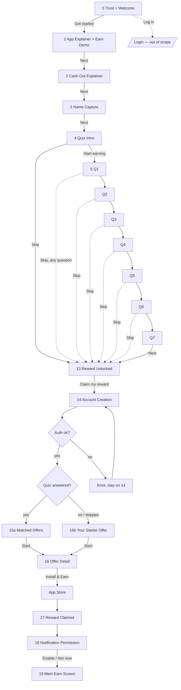
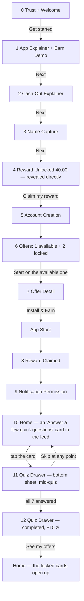
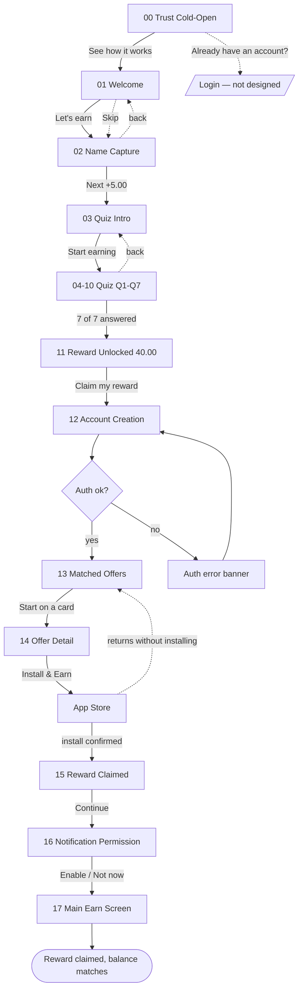

# Onboarding flow — structure and lo-fi

> **Three versions at once.** v2 is superseded (kept for history, in the
> section at the bottom of this file). **v3 and v4 are both live options**, not
> one layered over the other: v3 keeps the quiz inside onboarding (skippable),
> v4 lifts the quiz out of onboarding entirely and brings it back as a bottom
> drawer after login. The screens live in Figma, on the pages **"Onboarding —
> LoFi v3"** and **"Onboarding — LoFi v4 (quiz-as-drawer)"**.

Components and tokens: [design-system.md](design-system.md). Component audit:
[audit.md](audit.md). Moodboard and discovery: [research.md](research.md).

---

# v3 — the quiz inside onboarding, skippable

## Why v3 exists

The driving observation, verbatim: the old onboarding with its long
questionnaire **did not solve the problem it was meant to solve** — the time to
the first reward stayed long, and the process itself was not emotional enough.
v3 answers that with three structural changes:

1. **Trust and Welcome merged into one screen** (there were three) — one step
   fewer before any value.
2. **An emotional/gamified screen added** — a scripted match-3 demo with coins
   flying into the balance, instead of dry copy saying "we pay money".
3. **The quiz became genuinely skippable** — a visible "Skip" link on **every**
   question, not only in the intro. Previously the only way out was to skip the
   whole questionnaire at a single point; now it is available at any step, at
   any moment.

## Goal of the flow (unchanged)

**The user:** new, from the store, knows nothing about the product, short
attention span.
**One goal:** the first reward actually received in the first session (PRD,
primary metric).
**Success criterion:** screen 17 (Reward Claimed) is reached with no
unexplained step and no broken promise.

## Diagram

## Mapping: what was reused from v2, what was built new

A production shortcut for speed and consistency — some v2 content was not
redrawn but duplicated and edited.

| v3 screen | Source | Edit |
|---|---|---|
| 0 Trust + Welcome | v2 `00`, unchanged | stats: only Trustpilot remains (see the open question) |
| 3 Name Capture | v2 `02` | the real Earnings Meter starts here at 0.00 |
| 4 Quiz Intro | v2 `03` | + a visible "Skip" link |
| 5–11 Q1–Q7 | v2 `04–10` | + "Skip" on each; the CTA carries no amount (`Next`, not `Next [+X zł]`) |
| 13 Reward Unlocked | v2 `11`, unchanged | reached both from Q7 and from a skip |
| 14 Account Creation | v2 `12`, unchanged | — |
| 16–19 | v2 `14–17`, unchanged | Offer Detail, Reward Claimed, Notification, Main Earn |
| **1 App Explainer + Earn Demo** | — | **new**, the most important screen in v3 |
| **2 Cash-Out Explainer** | the content used to sit inside the old "Welcome" | **a new screen**: one idea, one screen |
| **15a Matched Offers** | v2 `13`, content unchanged | renamed for the fork |
| **15b Your Starter Offer** | — | **new**, an honest fallback with no false personalisation |

## The balance model — two different widgets, not one

This is a decision that the brief does not state literally, so it is recorded
explicitly rather than made silently. The brief shows `🪙 zł 0.40` identically
on screens 1–4 (the demo ticks 0→0.40, then holds flat), and from the quiz
onward (5–11) the amount grows to `40.00` — but it gives no concrete
per-question formula (it is annotated "e.g. 0.40 zł").

**Decision:** these are two different widgets, not one continuous counter.

- **The demo pill** (screens 1–2) — small, decorative, showing
  `0.00 → 0.40 zł` as an illustration that the balance is alive. It plays no
  part in the real reward economy.
- **The Earnings Meter** (screens 3–13) — the real tracker of the guaranteed
  reward. It starts **again from 0.00** on Name Capture and reaches **40.00** on
  Reward Unlocked. This honours PRD R5: the amount is fixed in advance and the
  meter only reveals it in parts.

The step-by-step numbers (7 questions, starting at 0.40 after the demo
illusion, while the real meter starts at 0.00 on Name Capture and grows over 8
steps — the name counts as a step, as it did in v2):

| Screen | Meter amount |
|---|---|
| 3 Name Capture → 4 Quiz Intro | 0.00 → 0.40 |
| 5 Q1 | 0.40 |
| 6 Q2 | 6.06 |
| 7 Q3 | 11.71 |
| 8 Q4 | 17.37 |
| 9 Q5 | 23.03 |
| 10 Q6 | 28.69 |
| 11 Q7 | 34.34 |
| 13 Reward Unlocked | 40.00 |

Why the numbers are not round (not 5.00 a step, as in v2): in the v3 template
the quiz button no longer carries the amount (`[ Next ]`, not
`[ Next +5.00 zł ]` — checked against the brief's ASCII), so the increment does
not need to look "marketing-pretty", only to make the meter visibly move. It
also reads as more honest than the old model: real accumulated amounts in real
products are rarely round.

This decision is an open question, raised in Figma and below: it is not certain
that a visible "demo vs real counter" split will be enough to stop a tester
from confusing the 0.40 demo with part of the real 40 zł.

## Screens — the reasoning for each

The full rationale cards sit on the canvas beside each screen in Figma (a
yellow frame marks an open question, a grey one a settled decision). This is the
summary.

| # | Screen | Why it is here |
|---|---|---|
| 0 | Trust + Welcome | Three screens before any value was the main drag; merging cuts a step while the trust signal (Trustpilot) stays |
| 1 | App Explainer + Earn Demo | The direct answer to "not emotional enough" — a scripted match-3, coins flying into the balance, no input required (a demo cannot fail) |
| 2 | Cash-Out Explainer | One idea, one screen (PRINCIPLES.md); the balance carries on flat from screen 1 |
| 3 | Name Capture | Cheap personalisation; the real Earnings Meter starts here |
| 4 | Quiz Intro | A real fork: "Start earning" OR a visible "Skip" |
| 5–11 | Q1–Q7 | "Skip" on every screen — you can leave at any point, not only at the start |
| 13 | Reward Unlocked | Reachable from Q7 and from a skip alike — the meter always reaches the full 40.00 |
| 14 | Account Creation | Unchanged; still unconfirmed from a fraud/compliance standpoint (PRD R7) |
| 15a | Matched Offers | Only when the quiz was genuinely answered — the heading has to be true |
| 15b | Your Starter Offer | An honest fallback for the skip path — no "picked for you" claim without data behind it |
| 16–19 | Offer Detail, Reward Claimed, Notification, Main Earn | Unchanged from v2 |

## Prototype

Not built in this pass — the request was for structure, annotations and
documentation; clickability was not asked for. Screens 3–11 already use
identical layer names (`Meter amount`, `Meter track > Fill`, `CTA`,
`Step counter`), so Smart Animate can be switched on the same way as in v2, as
a separate step.

## Open questions for v3

From the brief (§6), plus new ones that surfaced while building — none of them
passed over silently:

1. **Currency** — zł is used throughout this build (as the brief requires).
   Confirm that Allmedia does not want € for a wider audience.
2. **The "10M+ downloads" stat** — removed from screen 0 in this build, leaving
   only Trustpilot (a decision taken during this pass). Restoring it is a
   one-line edit.
3. **Where Skip lives** — implemented as a persistent link on every quiz screen
   (5–11), not only in the intro (4). Confirm that this is the intent, rather
   than a single "skip everything" button at the entrance.
4. **Screen 9 (the game-genre question)** — still an unseeded placeholder; the
   real fifth question in the app was never captured during research.
5. **Fraud/business validation** (carried over from the v2 PRD) — whether more
   than one offer may be shown to unverified users, and whether the current
   placement of registration is safe — still unconfirmed.
6. **The "demo balance vs real meter" seam** (this build's decision, not the
   brief's) — see the section above. Testing needs to confirm it does not
   confuse users.

---

# v4 — the quiz lifted out of onboarding, returned as a drawer after login

## Why v4 exists

After v3 was built, a further conclusion followed — not from the brief, but
from analysing the finished v3: even a skippable quiz **embedded in onboarding**
still makes the flow look long. Seven questions read as part of the path to the
first reward, even when they can formally be skipped. At the same time the
quiz's business value — the full set of 7 fields — cannot be given up.

**The v4 decision:** break the link between "get the guaranteed reward" and
"take the survey" physically, not just logically. Onboarding shrinks to 5
screens with no questions at all; the questionnaire returns **the way it was in
the original app** — a bottom drawer opened from the home screen after login —
but with a fully reconsidered container design and its own small reward,
separate from the guaranteed 40 zł.

This is a third option, not a replacement for v3 — both Figma pages stay live,
for comparison.

## Diagram

## Mapping: what was reused from v3

| v4 screen | Source | Edit |
|---|---|---|
| 0–2 (Trust, Demo, Cash-out) | v3 `00–02`, unchanged | — |
| 3 Name Capture | v3 `03` | the step counter is hidden — there is nothing left to count |
| 5 Account Creation | v3 `14`, unchanged | — |
| 7 Offer Detail, 8 Reward Claimed, 9 Notification | v3 `16–18`, unchanged | — |
| 10 Home | v3 `19` | + a new invitation card in the feed |
| **4 Reward Unlocked** | — | **new**, a direct reveal of 40.00 with no meter |
| **6 Offers** | card content from v3 `15b` | **a new form**: 1 available + 2 locked |
| **11 Quiz Drawer (mid-quiz)** | — | **new**, the centrepiece of v4 |
| **12 Quiz Drawer (completed)** | — | **new** |

## The balance model in v4 — simpler than in v3

In v3 the Earnings Meter grew across the quiz steps inside onboarding. In v4
there is no quiz in onboarding, so there is no meter either. The reward —
**40.00 zł — is revealed directly** on screen 4, all at once, with the same
"unlocked — all yours" wording as before, simply without the build-up. This is
not simplification out of laziness but a consequence: accumulating steps made
sense while the steps were quiz questions; once the questions left onboarding,
there was nothing left to accumulate.

The quiz bonus (+15 zł) is **a separate, standalone amount**, not part of the
40.00. It is granted in full once all 7 questions in the drawer are answered,
not one question at a time (unlike v3, where the meter grew with every answer).
That is a deliberate difference: the drawer is more compact, and splitting a
small amount into seven smaller ones reads badly at that size.

## Screen 6 (Offers) — the main guardrail of this version

This is the riskiest point in all of v4. The local temptation is to put an
enticing number on the locked card ("up to 7,468 zł 🔒") to push harder toward
the quiz. **That is deliberately not done.** It is exactly how the original
Freecash bug worked: a specific number is shown up front, and something else is
delivered (or nothing at all). The locked card in this build carries only
generic copy — "Locked offer — Unlocks after a few quick questions" — with no
number anywhere. Unlocking means a real offer with a real amount appears, not
one promised number swapped for another.

## Quiz Drawer — redesigning the container

The requirement was explicit: not like the original app. The original is a flat
rectangular drawer with no character. The new version:

- **A 28px radius on the top corners only** (larger than `rounded/04` from the
  design system — a deliberate step outside the scale here: a drawer is not a
  card inside a screen but a modal surface over it, and it is allowed more
  expressive geometry).
- **A drag handle** — a bar signalling that the sheet can be pulled and
  dismissed by gesture, rather than being a modal with a close button.
- **Progress dots** instead of a full-width progress bar — more compact, and
  better suited to the sheet's limited height.
- **A 45% scrim** — the home screen underneath stays recognisable, including the
  invitation card the sheet was opened from, so the link between action and
  result is not lost.
- Inside are the same components as the full-screen v3 quiz (`SelectorCard`,
  `CoinVoice`), simply laid out for a sheet rather than a whole screen.
- **Skip stays available at any moment** — the same "no dead ends" principle as
  v3, carried into the new container.

## Screens — the reasoning for each

The full rationale cards are on the Figma canvas beside each screen. Summary:

| # | Screen | Why it is like this |
|---|---|---|
| 0–2 | Trust, Demo, Cash-out | Unchanged — merging the screens already solved the length problem, whatever happens to the quiz |
| 3 | Name Capture | The step counter is removed — there is no quiz chain left for it to count |
| 4 | Reward Unlocked | A direct reveal of 40.00 with no meter — there is nothing left to accumulate |
| 5 | Account Creation | Unchanged; the same open fraud/compliance question (PRD R7) |
| 6 | Offers | 1 available + 2 locked; **guardrail** — no numbers on the locked ones |
| 7–9 | Offer Detail, Reward Claimed, Notification | Unchanged |
| 10 | Home | A new invitation card in the feed — the entry point to the quiz, opened by the user |
| 11 | Quiz Drawer, mid-quiz | A modern bottom sheet instead of the flat original; the same quiz components, a new container |
| 12 | Quiz Drawer, completed | +15 zł — a separate bonus, not part of the guaranteed 40.00 |

## Open questions for v4

1. **Trigger and incentive** — settled in discussion: a tappable card in the
   feed (not an auto-popup), and a separate small bonus of +15 zł. Recorded, not
   guessed.
2. **Seven questions, not three.** A note about the card's copy mentioned
   "3 questions" — read as promotional wording rather than a decision to shrink
   the dataset (the business value asked for the questionnaire to stay whole).
   The card's copy is deliberately generic ("a few quick questions", with no
   number) so the interface does not lie if the real count is not 3.
   **Confirm this reading.**
3. **What happens to screen 6 (Offers) if the user never opens the drawer.** In
   this build, nothing: the locked cards stay locked indefinitely. Unresolved:
   whether a repeat or more insistent prompt is needed after N days, or whether
   this is deliberately left to the user forever.
4. **Resume vs reset on an unfinished quiz.** If the user closes the drawer on
   question 3 of 7 and comes back later, progress should persist — otherwise
   v3's skip-at-any-moment stops being a real Skip and becomes "start over".
   Not implemented visually in this build (the lo-fi shows only 2 static
   states), but recorded as an interaction requirement.
5. **Whether the invitation card duplicates the existing offer cards in the
   feed.** It is visually distinct today (a green outline), but this is worth
   checking on a real screen with 5–10 offers to see whether it gets lost.
6. Items 1, 4, 6, 7, 8 and 9 from v3's open questions (currency, number format,
   `up to X zł` next to the guaranteed amount, question 9 about game genre)
   **apply to v4 unchanged** — this version inherits them rather than resolving
   them.

# History — v2 (superseded)

Below is the original v2 documentation, which led to the conclusion that the
quiz was too rigid (and so produced the v3 brief). This version's screens stay
in Figma on the page **"Onboarding — LoFi v2 (superseded)"** as a reference, not
as a working version.

## Goal of the flow (v2)

**Entry points:** a cold launch after install, the only one in this redesign.
Returning from the App Store after installing a game is a continuation of the
same flow, not an entry point.

**Assumptions** (taken from the v2 brief, not invented here): the 40.00 zł
reward is guaranteed and fixed; the name is collected before the quiz; the
account is created after the quiz but before the offer is handed over.

## Diagram (v2)

## Progress model (v2, rebuilt after the hand edits)

In those edits the counter and the meter drifted apart: the counter ran
`1/6 → 3/6 ×4 → 6/7 → 7/7`, the meter froze at `2.50 zł` across six screens,
and the button promised `+2.50 zł` against a total of `40.00 zł` — the
arithmetic did not add up anywhere.

Rebuilt into a single model: **8 steps × 5.00 zł = exactly 40.00 zł**.

| Step | Screen | Counter | "Earned so far" meter | Button |
|---|---|---|---|---|
| 1 | 02 Name Capture | 1/8 | — | Next [+5.00 zł] |
| — | 03 Quiz Intro | hidden | 5.00 zł | Start earning |
| 2 | 04 Q1 Gender | 2/8 | 5.00 zł | Next [+5.00 zł] |
| 3 | 05 Q2 Age | 3/8 | 10.00 zł | Next [+5.00 zł] |
| 4 | 06 Q3 Cash-out | 4/8 | 15.00 zł | Next [+5.00 zł] |
| 5 | 07 Q4 Purchases | 5/8 | 20.00 zł | Next [+5.00 zł] |
| 6 | 08 Q5 Game type | 6/8 | 25.00 zł | Next [+5.00 zł] |
| 7 | 09 Q6 Frequency | 7/8 | 30.00 zł | Next [+5.00 zł] |
| 8 | 10 Q7 Earn goal | 8/8 | 35.00 zł | Next [+5.00 zł] |
| — | 11 Reward Unlocked | hidden | 40.00 zł | Claim my reward |

## Prototype (v2)

A clickable prototype is assembled on the "Onboarding — LoFi v2 (superseded)"
page. Entry point `00 — Trust Cold-Open`, 33 connections.

- The chain from step 02 to 11 uses **Smart Animate** (0.45 s, ease-in-out), so
  the meter and the progress bar grow smoothly between screens. Layers carry
  identical names on every screen (`Header`, `Step counter`, `Meter amount`,
  `Meter track > Fill`, `CTA`): Smart Animate matches layers by name, and
  without that the numbers would simply blink.
- The remaining transitions are **Push** (0.35 s), with back as a rightward
  push.

## Steps (v2)

| # | Screen | What the user gets | Primary action | Errors / branches |
|---|---|---|---|---|
| 00 | Trust Cold-Open | Decide whether this can be trusted | See how it works | — |
| 01 | Welcome A | Understand what the product is | Next | Skip → 03 |
| 02 | Welcome B | Understand how to cash out | Let's go | Skip → 03 |
| 03 | Name Capture | Introduce themselves | Next | Empty field → button disabled |
| 04 | Quiz Intro | Understand how long it takes | Start earning | — |
| 05–11 | Quiz Q1–Q7 | Answer a question | Next | No selection → button disabled; "Prefer not to say" is a valid answer |
| 12 | Reward Unlocked | See what was earned | Claim my reward | — |
| 13 | Account Creation | Collect the reward | Continue with … | Provider declined / no network → banner, stay on 13 |
| 14 | Matched Offers | Pick a task | Start on a card | No offers → show the guaranteed one only |
| 15 | Offer Detail | Understand the terms | Install & Earn 40.00 zł | Returns without installing → back to 14 |
| 16 | Reward Claimed | Confirm they were paid | Continue | Reward not credited → a "processing" status, not an empty screen |
| 17 | Notification Permission | Decide about notifications | Enable notifications | Not now → 18 (not a dead end) |
| 18 | Main Earn | See the balance | — (the product takes over) | Balance not loaded → a skeleton, not "0.00" |

## Screen states (v2, applies to v3 as well)

- **Name Capture** — empty: the button is disabled, no hint needed. There are no
  errors: any name is valid.
- **Quiz** — empty: `Next` stays disabled until something is selected. No
  loading state needed: it is all local.
- **Auth** — loading: the `Loading` state on the social button (present in the
  design system). Error: a banner above the buttons, with the buttons still
  available.
- **Offers** — loading: card skeletons. Empty (v2) / the default for the skip
  branch (v3): show the guaranteed offer and an honest heading instead of
  "Picked for your goal".
- **Reward Claimed** — success: confetti and the amount. Deferred crediting:
  "Reward is on its way" instead of silence.
- **Main Earn** — loading: a balance skeleton. Never show `0.00 zł` before the
  server answers.

## Flow audit (v2 — partly stale, partly still current)

**Path length.** In v2 there were 17 screens before the first reward; v3 adds
two more (App Explainer + Earn Demo, and Cash-Out Explainer as its own screen)
but makes the quiz genuinely skippable — with Skip used, the path can end up
shorter than v2's.

**The question about mandatory fields — still current in v3.** By the data model
in build brief §4, **four of the seven questions — gender, age, in-app
purchases, play frequency — are marked "Backend only"** and never surface in the
copy. In v3 this hurts less: since the quiz is skippable, a user who cares
simply will not answer. But for those who do take it, the question stays open.

**No dead ends — preserved in v3.** Every error branch returns to the flow.

**One CTA per screen** — held everywhere except the offer lists and the main
screen, where the action belongs to the cards rather than the screen. That is
deliberate, and still true in v3.

## What changed in the hand edits (v2 → the revised v2) — and how the v3 brief answered it

**Worked, and carried into v3:**
- Merging screens to cut steps — the same principle became the basis of v3
  (Trust+Welcome).
- A back path on every quiz step.
- "Already have an account? Log in" on the trust screen.

**Resolved by the v3 brief:**
- Two progress indicators (`N/8` and the meter) — the v3 template does not put
  an amount on the quiz button at all, but the `N/8` counter stayed in the
  header, so the same question moved into v3's open questions (above).
- "Skip" on welcome led to the same place as the primary button — v3 solves it
  differently: the merged Trust+Welcome (screen 0) has no Skip at all, and Skip
  appears only from the quiz onward.

**Out of scope for the v3 brief, still current:**
- `up to 8,900 zł` for an 8-minute survey sitting next to a guaranteed
  `40.00 zł` — a trust risk, inherited unchanged on screen 15a.
- "~45 min daily" / "~8 min daily" — the same thing, untouched.
- Q5's "Three in a row" next to "Puzzle" — overlapping categories, untouched.
- Number formatting (`7,468 zł` rather than the Polish `7 468,00 zł`) —
  untouched.

## Next

Lo-fi v3 is the skeleton for edits to structure and copy. Screen 0 (Trust +
Welcome) already exists in hi-fi ([screens.md](screens.md)) and is not changed
by this brief. The next step is either a clickable v3 prototype (if needed) or
hi-fi for the new screen 1 (App Explainer + Earn Demo), the most substantial of
the additions.
